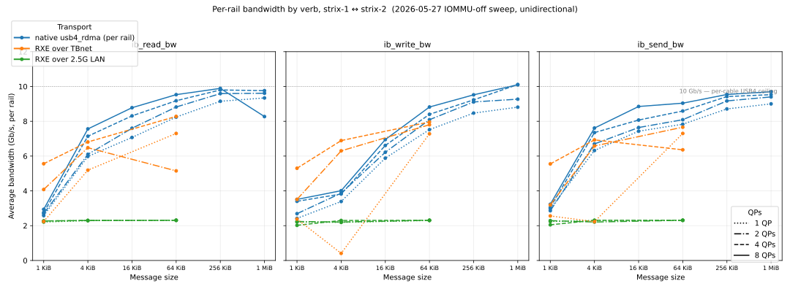
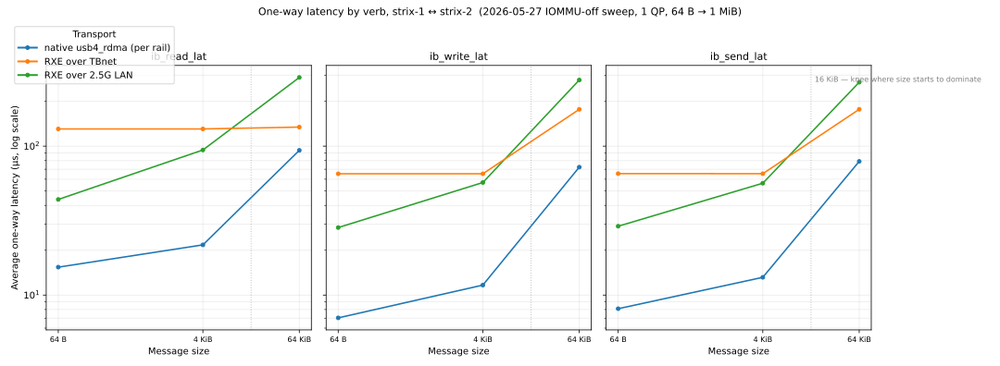

# thunderbolt-ibverbs

[](https://hydra.hellas.ai/job/hellas/thunderbolt-ibverbs/x86_64-linux.thunderbolt-ibverbs)

*** WARNING ***

this is a research driver. It is buggy, it is insecure, it is not for production.
see [docs/SECURITY.md](docs/SECURITY.md) for the current threat model and
implemented hardening boundaries.
for context, narrative, notes and benchmarks see the Hellas blog post:
https://blog.hellas.ai/blog/thunderbolt-ibverbs/

## what is it?
a linux kernel module + userspace shim to emulate an InfiniBand RDMA verb device across generic usb4/thunderbolt4 DMA rings


## does it work?
yes! obviously not as well as real hardware, but better than onboard ethernet and lower latency than RXE-over-`thunderbolt-net`





## does it do anything useful?
with my two 128GB devices, i can:

 - perform inference at ~20 tok/s on a 230B-param MoE model that doesn't fit on a single device — ~30% faster than running the same TP=2 split over TCP-over-Thunderbolt ([MiniMax-M2.7 TP=2 on 2× Strix Halo](https://blog.hellas.ai/blog/thunderbolt-ibverbs/5-closing/))
 - make batch=1 inference go faster with TP=2 than single node ([Llama-3.1-8B solo vs TP=2 4-HCA RDMA](https://blog.hellas.ai/blog/thunderbolt-ibverbs/4-thunderbolt-ibverbs/#vllm-benchmarks))
 - full finetune a 12b param model 11x faster than ethernet ([Gemma 3 12B full FSDP train wall time](https://blog.hellas.ai/blog/thunderbolt-ibverbs/4-thunderbolt-ibverbs/#finetune))

## i can do that better by doing xyz..
okay

## is it slop?
i guess

## how do i use it?
tell your agent- check out github.com/hellas-ai/thunderbolt-ibverbs and find out how we can use it

## no, really, how do i use it?
at a high level:

1. load the kernel module on the host (instructions per OS in [Install From GitHub Releases](#install-from-github-releases) below) — creates an IB device in `/sys/class/infiniband` per visible HCA
2. connect usb4 cables between hosts
3. run your workload against the device

## run inside a stock pytorch / vllm / llama.cpp container

the kernel module stays on the host. inside the container you just need our libibverbs provider so the stock `libibverbs.so` enumerates the device. drop the .deb in for your container's ubuntu codename:

```sh
docker run --rm -it \
    --device=/dev/infiniband \
    --cap-add=IPC_LOCK --ulimit memlock=-1 \
    pytorch/pytorch:latest bash

# inside the container — pick .jammy for ubuntu 22.04, .noble for 24.04:
apt install -y ibverbs-utils \
    https://github.com/hellas-ai/thunderbolt-ibverbs/releases/latest/download/usb4-rdma-provider_0.3.0.jammy_amd64.deb

ibv_devices
# device          	   node GUID
# ------          	----------------
# usb4_rdma0      	...
```

NCCL / UCX / perftest inside the container then see `usb4_rdma*` as a normal IB device.

if you want a batteries-included image with vllm / llama.cpp / rdma-core-usb4 / perftest already baked in (heavier — a few GB), use the ibverbs-enabled docker images from [github.com/hellas-ai/nix-strix-halo](https://github.com/hellas-ai/nix-strix-halo).

## that sounds complicated, is there any easier way?
sure, download and write the usb-bootable image from here, insert it into your machines, hit f11 while its booting to select the usb stick

For a repeatable two-node vLLM transport smoke, use the packaged bench helper.
It starts Ray, runs a tiny TP=2 vLLM workload, captures
`/sys/kernel/debug/thunderbolt_ibverbs/summary` before/after, and fails if the
TP run completes without moving RDMA counters:

```sh
tbv_vllm_smoke.sh \
  --hosts 192.168.23.136,192.168.23.192 \
  --iface eno1 \
  --transport native \
  --hca usb4_rdma5 \
  --wrapper /path/to/vllm-env \
  --require-rdma auto
```

For one command that runs both transport smoke (`tbv_vllm_smoke.sh`) and a
perftest verb smoke (`tbv-perftest`) with per-run result recording:

```sh
nix run .#tbv-regression -- \
  --hosts 192.168.23.136,192.168.23.192 \
  --iface eno1 \
  --transport native \
  --wrapper /path/to/vllm-env
```

The run writes `manifest.json`, `regression.json`, per-step logs, and perftest
CSV/JSONL into `thunderbolt-ibverbs/results/regression/<run-id>/`, then exits
non-zero if transport/verb smoke fails or if perftest metrics regress beyond
the configured thresholds versus baseline.

## Documentation

- [Architecture overview](docs/ARCHITECTURE.md) — kernel module ↔ provider ↔ verbs layer diagram and data path description
- [Troubleshooting guide](docs/TROUBLESHOOTING.md) — symptom-by-symptom checklist
- [Contributing guide](docs/CONTRIBUTING.md) — build instructions, code style, and PR process

## Status

- Native Linux-to-Linux verbs transport is the main path.
- Apple-compatible transport (`mac_compat` profile) works with macOS 12+
  on Apple Silicon Macs (M1/M2/M3/M4) connected via Thunderbolt 3/4/5.
  Known limitations: UC only (no RC), single DMA rail per link, no RDMA WRITE
  with immediate data, IOMMU pass-through not yet validated.
  See [docs/apple-hardware.md](docs/apple-hardware.md) for the full list and
  setup instructions.
- The module builds against stock kernels, but needs Linux 6.14 or newer
  (or this flake's `linux-thunderbolt` kernel) for the maintainer-tree
  Thunderbolt/USB4 subsystem changes it relies on.
- `nhi_interrupt_throttle_ns` is active only on kernels that export
  `tb_ring_throttling()`.
- The Nix flake builds a Thunderbolt testing kernel from the maintainer
  `next` branch with the local kernel patches applied.
- Debian, Fedora, Arch, and Nix builds are exercised in CI.

For the big-picture plan of where the project is headed — and the issue /
feature / PR workflow for each step — see [docs/ROADMAP.md](docs/ROADMAP.md).
All eight roadmap steps have shipped; their automation is archived under
[scripts/archive/roadmap/](scripts/archive/roadmap/).

The driver performance/security analysis findings, and the prioritized fixes
they drive, are tracked in [docs/FINDINGS.md](docs/FINDINGS.md). Automation that
files an issue + branch + draft PR per open finding lives in
[scripts/fixes/](scripts/fixes/).

## License

The kernel module is licensed under GPL-2.0-only, matching the SPDX tags in the
kernel sources and `MODULE_LICENSE("GPL")`.

Small userspace-facing test and protocol helper files that say
`GPL-2.0 OR BSD-3-Clause` may be used under either license.

## Install From GitHub Releases

Pre-built DKMS source packages are attached to GitHub Releases:

  https://github.com/hellas-ai/thunderbolt-ibverbs/releases

Each release ships two packages per distro: the DKMS source package for the
kernel module, and a userspace libibverbs provider so `ibv_devices` and
downstream RDMA tools (NCCL, perftest, vllm) enumerate the device.

```sh
# Debian or Ubuntu (needs Linux 6.14+)
sudo apt install \
    ./thunderbolt-ibverbs-dkms_<ver>_all.deb \
    ./usb4-rdma-provider_<ver>_amd64.deb

# Fedora
sudo dnf install \
    ./thunderbolt-ibverbs-dkms-<ver>-1.noarch.rpm \
    ./usb4-rdma-provider-<ver>-1.x86_64.rpm

# Arch
sudo pacman -U \
    ./thunderbolt-ibverbs-dkms-<ver>-1-any.pkg.tar.zst \
    ./usb4-rdma-provider-<ver>-1-x86_64.pkg.tar.zst
```

DKMS builds the kernel module against your running kernel on install and
rebuilds it after every kernel upgrade. Older kernels need the
`linux-thunderbolt` build from this flake — see "Nix Thunderbolt Kernel" below.

## Requirements

Install matching kernel headers and the basic module build tools.

Debian or Ubuntu:

```sh
sudo apt install build-essential dkms git kmod "linux-headers-$(uname -r)" rdma-core perftest
```

Fedora:

```sh
sudo dnf install dkms gcc git kernel-devel kernel-headers kmod make rdma-core perftest
```

Arch Linux:

```sh
sudo pacman -S --needed base-devel dkms git kmod linux-headers rdma-core perftest
```

## Install With DKMS

```sh
git clone https://github.com/hellas-ai/thunderbolt-ibverbs.git
cd thunderbolt-ibverbs

sudo make dkms-add
sudo make dkms-build
sudo make dkms-install
```

After a kernel upgrade, DKMS should rebuild the module for the new kernel.

To remove it:

```sh
sudo make dkms-remove
```

## Build Without DKMS

For a one-off build against the running kernel:

```sh
make KVER="$(uname -r)"
sudo make KVER="$(uname -r)" modules_install
sudo depmod -a
```

## Nix

Build the module package:

```sh
nix build github:hellas-ai/thunderbolt-ibverbs#thunderbolt-ibverbs
```

Other flake outputs:

```sh
nix build github:hellas-ai/thunderbolt-ibverbs#rdma-core-usb4   # libibverbs + usb4_rdma provider
nix build github:hellas-ai/thunderbolt-ibverbs#perftest         # ib_write_bw/ib_send_bw/... linked against rdma-core-usb4
nix build github:hellas-ai/thunderbolt-ibverbs#bench-tools      # u4_pingpong, uc_oneway, rc_write_*, tbv_perftest_runner, etc.
```

`nix develop` drops you in a shell with the module headers, `rdma-core-usb4`,
`perftest`, and the bench tools on PATH.

For benchmark hosts that need SSH aliases or a jump host, pass an SSH config to
the generated runner:

```sh
nix run .#tbv-perftest -- \
  --ssh-config /tmp/tbv_ssh_config \
  --hosts goblin,mbp-tb \
  --data-addrs goblin=192.168.0.1,mbp-tb=192.168.0.2
```

On NixOS, add the flake input and import the module:

```nix
{
  inputs.thunderbolt-ibverbs.url = "github:hellas-ai/thunderbolt-ibverbs";

  outputs = { nixpkgs, thunderbolt-ibverbs, ... }: {
    nixosConfigurations.host = nixpkgs.lib.nixosSystem {
      system = "x86_64-linux";
      modules = [
        thunderbolt-ibverbs.nixosModules.default
        {
          hardware.thunderbolt-ibverbs.enable = true;
        }
      ];
    };
  };
}
```

Downstream flakes can compose the package set through the default overlay:

```nix
{
  nixpkgs.overlays = [
    thunderbolt-ibverbs.overlays.default
  ];
}
```

The overlay provides `rdma-core-usb4`, `thunderbolt-ibverbs`,
`thunderbolt-ibverbs-perftest`, and `thunderbolt-ibverbs-bench-tools` on Linux.

## Load And Use

Connect the Thunderbolt/USB4 hosts first. On both Linux peers, load the module
with the native Linux transport enabled:

```sh
sudo modprobe thunderbolt_ibverbs \
  profile=linux_perf \
  bind_services=1 \
  allocate_rings=1 \
  start_rings=1 \
  negotiate_native=1 \
  enable_tunnels=1 \
  register_verbs=1
```

If userspace needs a RoCE netdev for GID metadata, pass one explicitly:

```sh
sudo modprobe thunderbolt_ibverbs \
  profile=linux_perf \
  bind_services=1 allocate_rings=1 start_rings=1 \
  negotiate_native=1 enable_tunnels=1 register_verbs=1 \
  roce_netdev=thunderbolt0
```

Check that the device registered:

```sh
dmesg | grep thunderbolt_ibverbs
ibv_devices
rdma link
```

With `perftest` installed, select the reported RDMA device explicitly:

```sh
# peer A
ib_write_bw -d usb4_rdma0

# peer B
ib_write_bw -d usb4_rdma0 <peer-a-address>
```

Unload the module before changing static load parameters:

```sh
sudo modprobe -r thunderbolt_ibverbs
```

To make a known-good configuration persistent, put the options in
`/etc/modprobe.d/thunderbolt-ibverbs.conf`.

## Apple↔Linux Transport (mac_compat)

Connect a Thunderbolt cable between a Linux host and an Apple Silicon Mac
(M1/M2/M3/M4, macOS 12+). On the Linux host:

```sh
sudo modprobe thunderbolt_ibverbs \
  profile=mac_compat \
  bind_services=1 \
  allocate_rings=1 \
  start_rings=1 \
  enable_tunnels=1 \
  register_verbs=1
```

With `profile=mac_compat` the module auto-enables the Apple data path
(`apple_data=auto` → on) and uses the minimal ThunderboltIP identity to
negotiate with the macOS peer before the verbs rail comes up.

Check device registration and GIDs:

```sh
dmesg | grep thunderbolt_ibverbs
ibv_devices          # should show usb4_rdma0 or usb4_apple0
rdma link show
```

From the macOS side use the Apple-patched `mac_tb_rdma_probe` to probe the
link:

```sh
# macOS — probe only (no traffic):
MAC_TB_RDMA_PROBE_RTR=1 mac_tb_rdma_probe rdma_en1 <linux-peer-ip>

# macOS — probe + one UC SEND:
MAC_TB_RDMA_PROBE_RTR=1 MAC_TB_RDMA_PROBE_SEND=1 \
  mac_tb_rdma_probe rdma_en1 <linux-peer-ip> <linux-qpn> 7
```

See [docs/apple-hardware.md](docs/apple-hardware.md) for supported hardware,
known limitations, and the full interop procedure including `perftest`.

## Useful Parameters

```text
profile=linux_perf|mac_compat|mixed
tbnet=auto|allow|prefer_rdma|block
lanes=auto|N|MIN-MAX
register_verbs=0|1
native_fragment_striping=0|1
zcopy_min_bytes=<bytes>
qp_timeout_ms=<ms>
nhi_interrupt_throttle_ns=<ns>
```

Run `make -C kernel help` for the full parameter list.

For recommended values and the benchmark sweep that produced them, see
[**`docs/TUNING.md`**](docs/TUNING.md).

## Nix Thunderbolt Kernel

The module loads on stock kernels. For the maintainer-tree USB4 work, the flake
also exposes `linux-thunderbolt`: nixpkgs' `linuxPackages_testing.kernel` with
only the source, version, and kernel patch list overridden. It uses the nixpkgs
testing kernel configuration, not a machine-local config.

```sh
nix build .#linux-thunderbolt
nix build .#thunderbolt-ibverbs-linux-thunderbolt
```

On NixOS, use that kernel package set and enable the module:

```nix
{ pkgs, inputs, ... }:
let
  system = pkgs.stdenv.hostPlatform.system;
  tbv = inputs.thunderbolt-ibverbs.packages.${system};
in {
  boot.kernelPackages = pkgs.linuxPackagesFor tbv.linux-thunderbolt;
  hardware.thunderbolt-ibverbs.enable = true;
}
```

Hydra evaluates the same path through
`hydraJobs.x86_64-linux.linux-thunderbolt` and
`hydraJobs.x86_64-linux.thunderbolt-ibverbs-linux-thunderbolt`.
